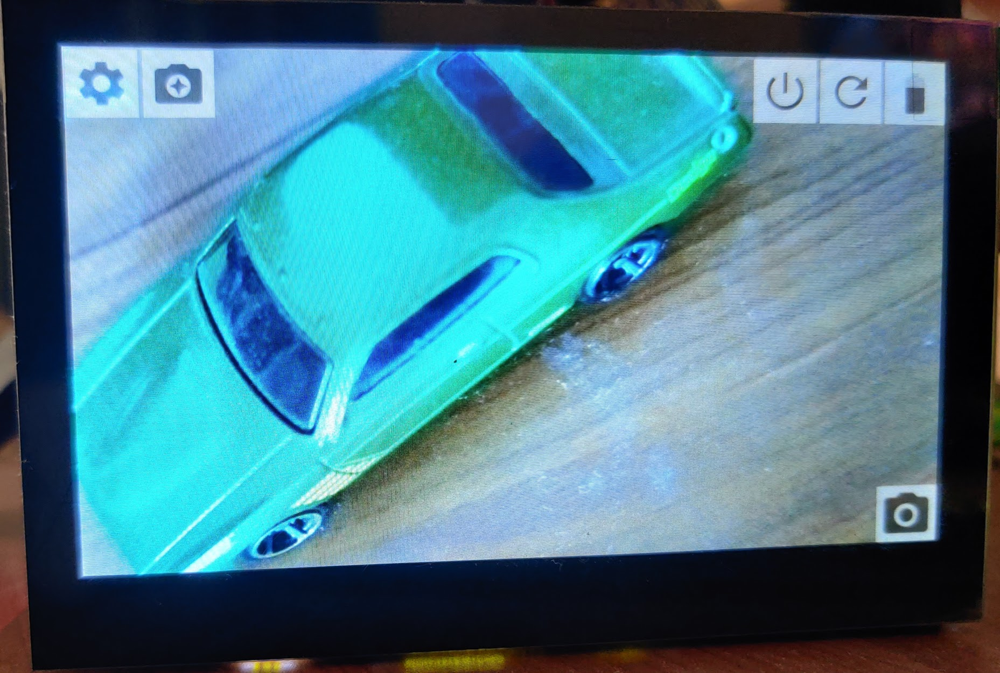
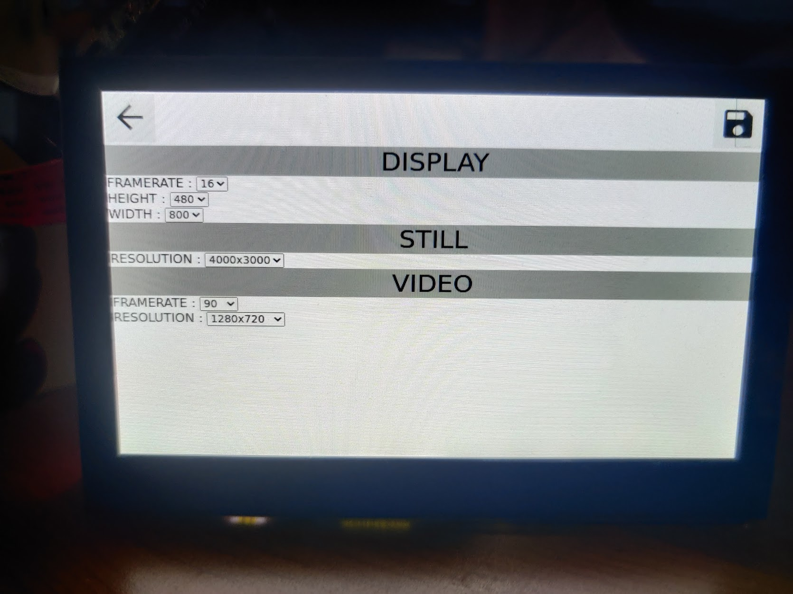
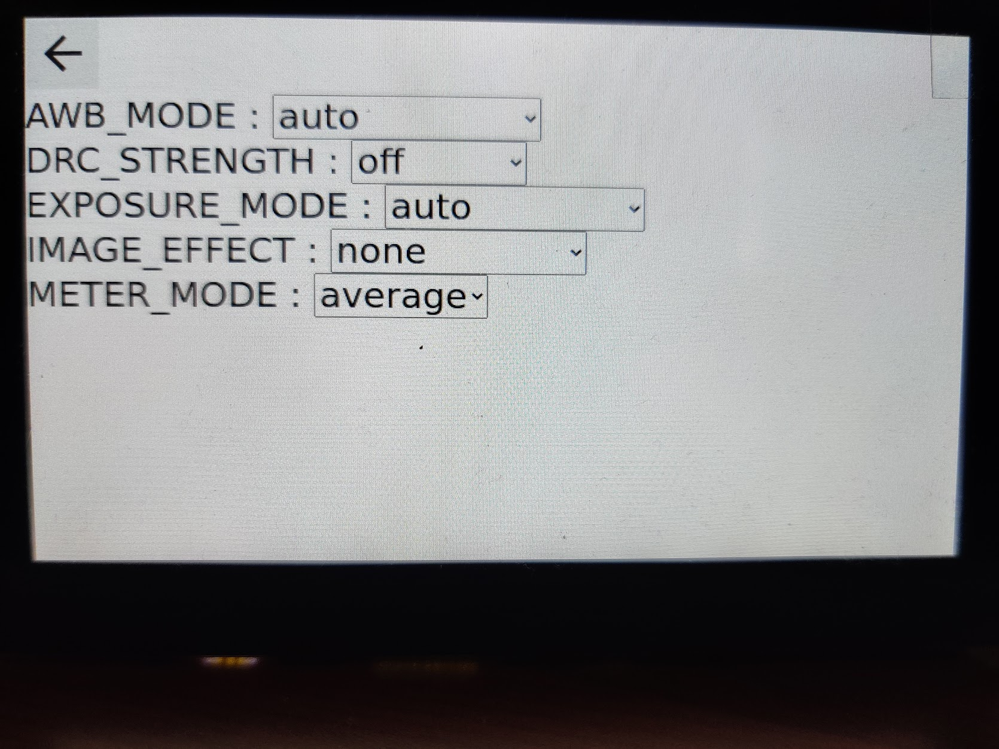

# BlitzCam
Camera interface for Raspberry Pi HQ Camera + HDMI touchscreen

## Planned features
* Take Photos and save to a path (Done)
* Settings Interface for saving camera settings (Done)
* Support for others Display Resolutions 
* Gallery View
* All features of HQ camera supported from touch UI
* Add Video support
* Support for GPIO shutter
* ?? Send files to ftp/smb/ssh
* ?? Support hotspot with shared gallery
* battery details (added using Waveshare ups_hat)

## Screenshots
camera interface (WIP)

Settings interface (WIP)

Mode Selection (WIP)

## Requirements
Raspberry Pi

Compatible Camera

Dietpi + chromium autostart configured + python3 installed

Unclutter optional

## Custom OS tweaks
* Start blitz_cam server on boot
* Start unclutter after X (to disable mouse pointer)